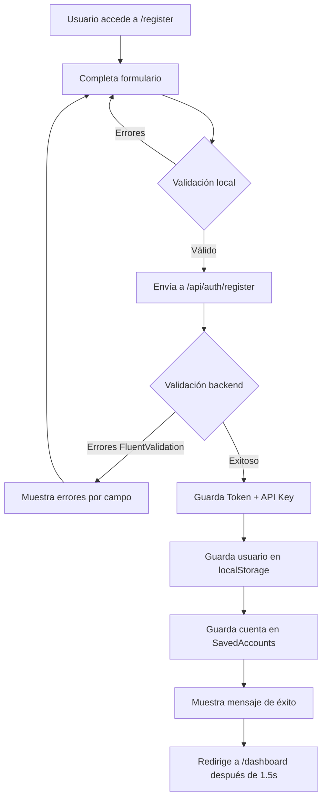

# Implementación del Componente de Registro

Este documento describe la implementación completa del componente de registro de usuarios con UI de Metronic.

## Tabla de Contenidos

1. [Descripción General](#descripción-general)
2. [Estructura de Archivos](#estructura-de-archivos)
3. [Características Implementadas](#características-implementadas)
4. [Validaciones](#validaciones)
5. [Integración con Backend](#integración-con-backend)
6. [Flujo de Registro](#flujo-de-registro)
7. [Uso y Navegación](#uso-y-navegación)
8. [Testing](#testing)

---

## Descripción General

El componente de registro (`RegisterComponent`) permite a nuevos usuarios crear una cuenta en el sistema MasterBackup. Al registrarse, se crea automáticamente:
- Un nuevo **Tenant** (organización)
- Un usuario **administrador** para ese tenant
- Una **API Key** única para el tenant

El componente utiliza:
- **Angular 18.2** con componentes standalone
- **Reactive Forms** para gestión de formularios
- **Metronic UI** para el diseño visual
- **FluentValidation** del backend para validación de datos

---

## Estructura de Archivos

```
src/app/features/register/
└── components/
    ├── register.component.ts       # Lógica del componente
    ├── register.component.html     # Template con Metronic UI
    └── register.component.css      # Estilos personalizados
```

### Archivos Relacionados

- `src/app/core/models/auth.models.ts` - Define `RegisterDto` interface
- `src/app/core/services/auth.service.ts` - Método `register()` para API
- `src/app/app.routes.ts` - Configuración de ruta `/register`

---

## Características Implementadas

### 1. Formulario Reactivo

El formulario incluye los siguientes campos:

| Campo | Tipo | Descripción | Requerido |
|-------|------|-------------|-----------|
| `tenantName` | text | Nombre de la organización | Sí |
| `firstName` | text | Nombre del usuario | Sí |
| `lastName` | text | Apellido del usuario | Sí |
| `email` | email | Correo electrónico (único globalmente) | Sí |
| `password` | password | Contraseña con complejidad | Sí |
| `confirmPassword` | password | Confirmación de contraseña | Sí |
| `enableTwoFactor` | checkbox | Habilitar 2FA por email | No |

### 2. Indicador de Fuerza de Contraseña

El componente incluye un **indicador visual** que muestra la fuerza de la contraseña en tiempo real:

- **Débil**: Contraseña de 8+ caracteres básicos (rojo)
- **Regular**: Incluye mayúsculas y minúsculas (naranja)
- **Buena**: Incluye números (azul)
- **Fuerte**: Incluye caracteres especiales (verde)

```typescript
getPasswordStrength(): number {
  const password = this.registerForm.get('password')?.value || '';
  let strength = 0;
  
  if (password.length >= 8) strength++;
  if (password.length >= 12) strength++;
  if (/[a-z]/.test(password)) strength++;
  if (/[A-Z]/.test(password)) strength++;
  if (/[0-9]/.test(password)) strength++;
  if (/[^a-zA-Z0-9]/.test(password)) strength++;
  
  return Math.min(strength, 4);
}
```

### 3. Mostrar/Ocultar Contraseñas

Botones toggle para revelar u ocultar el texto de las contraseñas:

```html
<button type="button" 
        class="btn btn-icon btn-sm btn-active-color-primary position-absolute end-0 top-50 translate-middle-y me-2"
        (click)="togglePasswordVisibility()">
  <i class="ki-duotone ki-eye{{ showPassword ? '-slash' : '' }} fs-2">
    <span class="path1"></span>
    <span class="path2"></span>
    <span class="path3" *ngIf="showPassword"></span>
  </i>
</button>
```

### 4. Manejo de Errores del Backend

El componente maneja errores de **FluentValidation** del backend:

```typescript
error.error.errors.forEach((err: { field: string; message: string }) => {
  // Convertir PascalCase del backend a camelCase del frontend
  const fieldName = err.field.charAt(0).toLowerCase() + err.field.slice(1);
  this.fieldErrors.set(fieldName, err.message);
});
```

**Formato de error del backend:**
```json
{
  "success": false,
  "errors": [
    { "field": "Email", "message": "El email ya está registrado" },
    { "field": "Password", "message": "La contraseña debe tener al menos 8 caracteres" }
  ]
}
```

### 5. Mensajes de Estado

- ✅ **Mensaje de éxito**: Muestra cuando el registro es exitoso
- ❌ **Mensaje de error general**: Muestra errores no relacionados con campos
- 🔴 **Errores por campo**: Se muestran debajo de cada input

### 6. Estado de Carga

El botón de submit muestra un spinner mientras se procesa la solicitud:

```html
<button type="submit" 
        class="btn btn-primary btn-lg"
        [disabled]="registerForm.invalid || isSubmitting">
  <span *ngIf="!isSubmitting">Crear Cuenta</span>
  <span *ngIf="isSubmitting" class="indicator-label">
    Por favor espere...
    <span class="spinner-border spinner-border-sm align-middle ms-2"></span>
  </span>
</button>
```

---

## Validaciones

### Validaciones Locales (Frontend)

El componente implementa validaciones que coinciden con las del backend:

#### Email
- **Required**: Campo obligatorio
- **Email format**: Formato válido de email
- **MaxLength(255)**: Máximo 255 caracteres

#### Password
- **Required**: Campo obligatorio
- **MinLength(8)**: Mínimo 8 caracteres
- **MaxLength(100)**: Máximo 100 caracteres
- **Complexity**: Al menos 1 mayúscula, 1 minúscula, 1 dígito

```typescript
private passwordComplexityValidator(control: AbstractControl): ValidationErrors | null {
  const value = control.value;
  if (!value) return null;

  const hasUpperCase = /[A-Z]/.test(value);
  const hasLowerCase = /[a-z]/.test(value);
  const hasDigit = /[0-9]/.test(value);

  const valid = hasUpperCase && hasLowerCase && hasDigit;

  if (!valid) {
    return { 
      passwordComplexity: 'La contraseña debe contener al menos una mayúscula, una minúscula y un dígito' 
    };
  }

  return null;
}
```

#### Confirm Password
- **Required**: Campo obligatorio
- **Match**: Debe coincidir con `password`

```typescript
private passwordMatchValidator(group: AbstractControl): ValidationErrors | null {
  const password = group.get('password')?.value;
  const confirmPassword = group.get('confirmPassword')?.value;

  if (password !== confirmPassword) {
    return { passwordMismatch: true };
  }

  return null;
}
```

#### First Name / Last Name
- **Required**: Campo obligatorio
- **MaxLength(50)**: Máximo 50 caracteres

#### Tenant Name
- **Required**: Campo obligatorio
- **MaxLength(100)**: Máximo 100 caracteres

### Validaciones del Backend (FluentValidation)

El backend aplica las mismas validaciones más:
- **Email Único**: Verifica que el email no esté registrado globalmente
- **Formato específico**: Validaciones adicionales de formato

---

## Integración con Backend

### Endpoint

```
POST /api/auth/register
```

### Request DTO

```typescript
export interface RegisterDto {
  email: string;
  password: string;
  firstName: string;
  lastName: string;
  tenantName: string;
  enableTwoFactor: boolean;
}
```

### Response Exitoso

```json
{
  "success": true,
  "message": "Usuario registrado exitosamente",
  "token": "eyJhbGciOiJIUzI1NiIs...",
  "apiKey": "tenant_123e4567-e89b-12d3-a456-426614174000",
  "user": {
    "id": "user-id",
    "email": "usuario@ejemplo.com",
    "firstName": "Juan",
    "lastName": "Pérez",
    "role": "Admin",
    "tenantId": "tenant-id"
  },
  "tenantId": "tenant-id"
}
```

### Response con Error

```json
{
  "success": false,
  "errors": [
    {
      "field": "Email",
      "message": "El correo electrónico ya está registrado"
    },
    {
      "field": "Password",
      "message": "La contraseña debe contener al menos una mayúscula"
    }
  ]
}
```

### Método del Servicio

```typescript
// auth.service.ts
register(dto: RegisterDto): Observable<AuthResponse> {
  return this.http.post<AuthResponse>(`${this.apiUrl}/auth/register`, dto).pipe(
    tap(response => {
      if (response.success && response.token) {
        this.handleSuccessfulLogin(response, dto.email);
      }
    })
  );
}
```

---

## Flujo de Registro



### Detalle del Flujo

1. **Usuario completa el formulario**
   - Escribe email, password, nombres, organización
   - Opcionalmente habilita 2FA

2. **Validación local**
   - Angular Reactive Forms valida en tiempo real
   - Muestra errores debajo de cada campo

3. **Envío al backend**
   - Se excluye `confirmPassword` del DTO
   - LoadingInterceptor muestra spinner automáticamente
   - AuthInterceptor NO agrega headers (no hay token aún)

4. **Procesamiento en el backend**
   - Valida con FluentValidation
   - Verifica email único globalmente
   - Crea Tenant con ApiKey
   - Crea usuario Admin con Identity
   - Genera JWT con claim TenantId

5. **Respuesta exitosa**
   - `handleSuccessfulLogin()` guarda token y API Key
   - Guarda usuario en `currentUser`
   - Agrega cuenta a `savedAccounts`
   - Muestra mensaje de éxito

6. **Redirección**
   - Después de 1.5 segundos → `/dashboard`
   - Dashboard valida que haya usuario autenticado

---

## Uso y Navegación

### Acceso al Componente

El usuario puede acceder al registro desde:

1. **URL directa**: `http://localhost:4200/register`
2. **Link desde Login**: En la parte inferior del login hay un enlace "Regístrate aquí"

```html
<!-- login.component.html -->
<div class="text-gray-500 text-center fw-semibold fs-6 mt-10">
  ¿No tienes una cuenta?
  <a routerLink="/register" class="link-primary">Regístrate aquí</a>
</div>
```

### Después del Registro

Tras un registro exitoso:
- El usuario es **automáticamente autenticado**
- Se redirige al **Dashboard**
- Puede cerrar sesión y volver a iniciar sesión con su email

---

## Testing

### Casos de Prueba Manuales

#### 1. Registro Exitoso
```
Tenant: Mi Empresa S.A.
Nombre: Juan
Apellido: Pérez
Email: juan.perez@empresa.com
Password: MiPassword123
Confirm Password: MiPassword123
2FA: ✓ Habilitado

Resultado esperado:
✅ Registro exitoso
✅ Redirige a /dashboard
✅ Token y API Key guardados
✅ Usuario autenticado
```

#### 2. Email Duplicado
```
Email: juan.perez@empresa.com (ya existe)

Resultado esperado:
❌ Error: "El correo electrónico ya está registrado"
```

#### 3. Contraseñas No Coinciden
```
Password: MiPassword123
Confirm Password: OtraPassword123

Resultado esperado:
❌ Error local: "Las contraseñas no coinciden"
❌ Botón deshabilitado
```

#### 4. Contraseña Débil
```
Password: abc123

Resultado esperado:
❌ Error: "La contraseña debe tener al menos 8 caracteres"
❌ Indicador de fuerza en rojo
```

#### 5. Email Inválido
```
Email: no-es-un-email

Resultado esperado:
❌ Error local: "Ingrese un correo electrónico válido"
```

#### 6. Campos Vacíos
```
Submit sin completar campos

Resultado esperado:
❌ Todos los campos requeridos muestran errores
❌ Botón deshabilitado
```

### Testing de Integración

#### API Endpoints
```bash
# Test de registro exitoso
POST http://localhost:5000/api/auth/register
Content-Type: application/json

{
  "email": "test@example.com",
  "password": "TestPass123",
  "firstName": "Test",
  "lastName": "User",
  "tenantName": "Test Company",
  "enableTwoFactor": true
}

# Verificar que se guardaron datos
SELECT * FROM "Tenants" WHERE "Name" = 'Test Company';
SELECT * FROM "AspNetUsers" WHERE "Email" = 'test@example.com';
```

### Testing Automatizado (Recomendado)

```typescript
// register.component.spec.ts
describe('RegisterComponent', () => {
  it('should validate password complexity', () => {
    component.registerForm.patchValue({ password: 'weak' });
    expect(component.registerForm.get('password')?.errors?.['minlength']).toBeTruthy();
  });

  it('should match passwords', () => {
    component.registerForm.patchValue({
      password: 'Pass123',
      confirmPassword: 'Different123'
    });
    expect(component.registerForm.errors?.['passwordMismatch']).toBeTruthy();
  });

  it('should calculate password strength correctly', () => {
    component.registerForm.patchValue({ password: 'WeakPass123!' });
    expect(component.getPasswordStrength()).toBe(4);
  });
});
```

---

## Notas Importantes

### Seguridad

1. **Nunca mostrar API Key en UI**: El componente guarda el API Key en localStorage pero NO lo muestra al usuario
2. **HTTPS en producción**: Asegurar que el registro se haga sobre HTTPS
3. **Rate limiting**: El backend debe implementar rate limiting para prevenir ataques de fuerza bruta

### Mejoras Futuras

1. **Verificación de email**: Enviar código de verificación antes de activar la cuenta
2. **Validación en tiempo real**: Verificar disponibilidad de email mientras el usuario escribe
3. **Términos y condiciones**: Agregar checkbox de aceptación de términos
4. **CAPTCHA**: Implementar reCAPTCHA para prevenir bots
5. **Registro con OAuth**: Google, Microsoft, GitHub, etc.
6. **Password strength meter mejorado**: Usar librería como zxcvbn

---

## Conclusión

El componente de registro está completamente implementado y listo para usar. Incluye:
- ✅ Validación frontend y backend
- ✅ Integración con sistema de autenticación
- ✅ Manejo de errores de FluentValidation
- ✅ UI profesional con Metronic
- ✅ Indicador de fuerza de contraseña
- ✅ Guardado automático de sesión
- ✅ Redirección a dashboard

El flujo completo de autenticación (Registro → Login → 2FA → Dashboard) está operativo.
